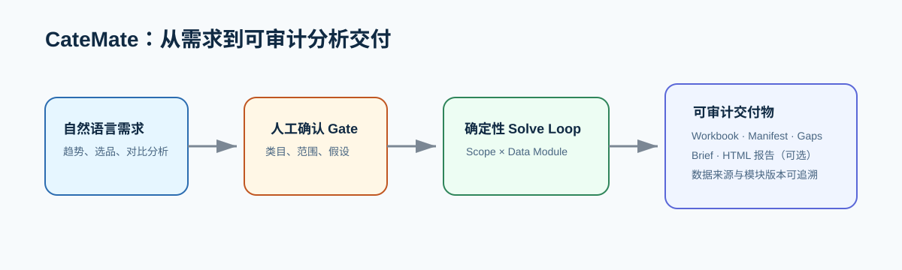
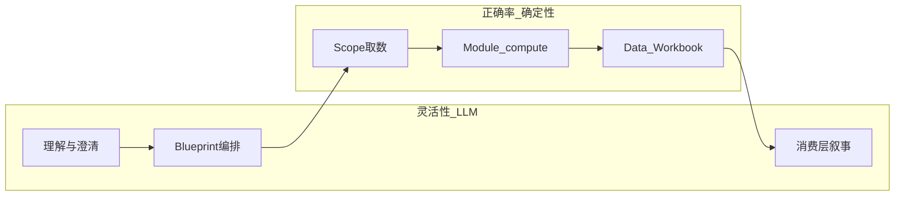
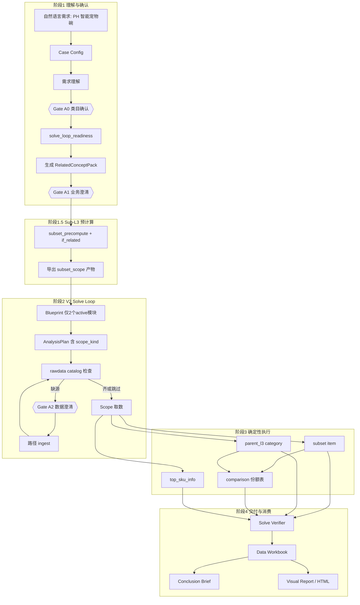
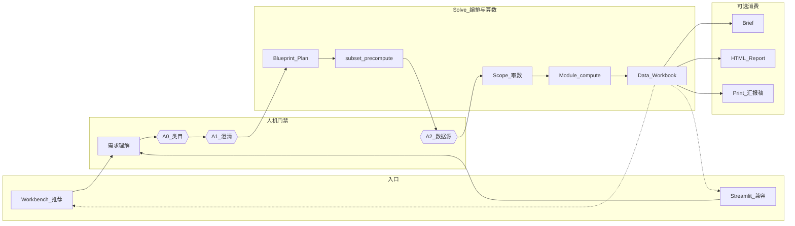

# CateMate

> 面向品类分析的可审计 AI 工作台：把自然语言需求转化为可确认、可追溯的 Data Workbook 分析流水线。

[](https://github.com/coco20020806/CateMate/actions/workflows/ci.yml)
[](requirements-dev.txt)
[](CHANGELOG.md)



## 30 秒了解 CateMate

- **业务需求可确认**：将自然语言需求拆成类目、范围、假设和分析意图，并通过人工 Gate 确认。
- **数字计算可验证**：LLM 只负责理解与编排；Scope 与已登记的 Data Module 负责确定性取数和计算。
- **交付结果可审计**：输出 Data Workbook、运行 manifest 与 Gaps；未覆盖需求会明确标注，而非编造结果。

**公开数据声明：** 本仓库全部示例类目、商品、站点、指标及链接均为合成演示数据；不含雇主生产数据、内部数据或真实经营数据。

### 合成数据 Demo

复制下面的需求，在 Workbench 中体验完整路径：

```text
分析 PH 宠物配件类目中“智能喂食器”相关商品最近三个月的 GMV 与订单趋势，并输出头部 SKU 供选品参考。
```

流程为：**自然语言需求 → Gate A0/A1 人工确认 → Scope × Data Module 确定性计算 → Data Workbook / Brief / HTML 报告**。详细输入、输出和 Gaps 示例见 [docs/demo/README.md](docs/demo/README.md)。

### 三步启动（推荐 Workbench）

前置条件：Windows PowerShell、Python 3.11+、Node.js（含 Corepack）。首次运行执行：

```powershell
git clone https://github.com/coco20020806/CateMate.git
cd CateMate
.\scripts\run_demo.ps1
```

脚本会创建 `.venv`、安装依赖、导入合成数据并启动 Workbench。随后访问 `http://localhost:5173`。如依赖已安装，可使用 `.\scripts\run_demo.ps1 -SkipInstall`。

### 质量检查

公开仓库不含机密 `CateMate_rawdata`。CI / 快速检查请跑：

```powershell
.\.venv\Scripts\python.exe -m pytest -q tests/test_public_demo_smoke.py tests/data_modules tests/catemate/scope/test_related.py tests/catemate/scope/test_if_related_e2e.py
.\.venv\Scripts\python.exe scripts\validate_v3_data_modules.py
.\.venv\Scripts\python.exe scripts\check_public_repo.py
```

本地放入真实 rawdata 后，可再跑全量 `pytest -q`。

---

> 面向 **Category Analysis** 的 AI 辅助工作流 Demo — 把自然语言需求，转成可确认、可追溯、可审计的 **Data Workbook** 分析流水线。

[](LICENSE)
[](requirements.txt)
[](CateMate-Workbench/)
[](api/catemate_api.py)
[](app/streamlit_dashboard.py)
[](docs/CATEMATE_V2_DESIGN_OVERVIEW.md)
[](CHANGELOG.md)

**个人 AI Demo 项目，非生产系统。** 仓库不含真实业务源数据，请用 [`examples/`](examples/) 合成数据体验。

**推荐入口（v1.3.0）**：`python scripts/start_workbench.py` → http://localhost:5173  
中文操作说明 → [README_使用说明.md](README_使用说明.md) · 版本记录 → [CHANGELOG.md](CHANGELOG.md)

---

## 核心设计思想

> **AI 负责「问什么 / 怎么编排」；写死的 Data Module + Scope 负责「算什么 / 算对」——用模块化边界换取 Agent 灵活性与数值正确率的平衡。**

CateMate 把 Data Agent 拆成三层，避免「LLM 即兴算数」与「规则系统无法理解意图」两端：

| 层 | 职责 | 灵活性 | 正确率保障 |
|----|------|--------|------------|
| **认知层（LLM）** | 需求理解、类目确认、Concept Pack、Blueprint、指标扩展、结论/可视化提案 | 高：自然语言 → 结构化意图 | 输出经 schema / catalog 校验；失败有规则 fallback |
| **契约层（确定性）** | `data_modules/*/compute.py`、`source_schema`、active 白名单、`output_grain_policy` | 低：Agent 只能调用已登记能力 | 数字只来自写死 Python + pytest |
| **取数层（Scope）** | 站点/类目过滤；Sub-L3 用 `if_related` 打分过滤 | 中：同一内核 × 多种 `scope_kind` | 过滤规则可审计落盘，不由 LLM 挑行 |



V2 核心公式：**分析语义 = Scope（取数）× Data Module（写死 Python 算数）**

完整设计 → [docs/CATEMATE_V2_DESIGN_OVERVIEW.md](docs/CATEMATE_V2_DESIGN_OVERVIEW.md)

---

## V2 进度（当前迭代 · v1.3.0）

默认分析模式为 **`v2_solve_loop`**。主交付物仍是 **`data_workbook_*.xlsx`**（Plan + 数据表族 + Gaps）；其上可再生成 Conclusion Brief、HTML Visual Report 与 Print 汇报稿。  
**v1.3.0 推荐用 Workbench（React）操作整条流水线**；Streamlit 总控台仍可用。

| 阶段 | 内容 | 状态 |
|------|------|------|
| **0** | 可执行 data modules（`compute.py` + pytest） | ✅ 2 active + 5 draft |
| **1** | `rawdata_catalog.yaml` + 三维度源表登记 | ✅ 已落地 |
| **2** | Scope 取数层 + Sub-L3 `if_related` | ✅ 已落地 |
| **3** | 意图编排 Solve Loop + 数据澄清 ingest | ✅ 已落地 |
| **4** | Data Workbook 组装（Plan / Data / Gaps） | ✅ 已落地 |
| **4b** | Sub-L3 预计算 / ScopeCache / 过滤规则产物 | ✅ 已落地 |
| **4c** | multi-scope：`subset` / `parent_l3` / `comparison` | ✅ 已落地 |
| **5** | 用 V2 模块逐步替换 V1 YAML 模块 | 🔄 进行中 |
| **6** | Conclusion Brief + HTML Visual Report + Print 汇报稿 消费 Workbook | ✅ 已落地 |
| **7** | Workbench UI + FastAPI 桥接（类目确认 / 澄清 / Solve / Deliverables） | ✅ 已落地 |

**V2 solve loop 已启用模块**（`contract.yaml` 中 `status: active`）：

| module_id | 用途 |
|-----------|------|
| `monthly_market_trend` | 月度 GMV / Orders / AOV 趋势（含子集 vs 父 L3 份额对比） |
| `top_sku_info` | Sub-L3 / 相关概念包下的 Top SKU |

**Draft 模块**（保留 `compute.py` 与单测，不参与 blueprint / 执行）：`daily_cncb_performance`、`price_tier_distribution`、`top_shop`、`top_listing`、`keywords`

校验：`python scripts/validate_v3_data_modules.py`

---

## 项目结构

```text
CateMate/
├── app/                          # Streamlit 交互层
│   ├── streamlit_dashboard.py    # 总控台（默认 v2_solve_loop）
│   ├── category_confirmation_editor.py
│   ├── clarification_editor.py   # 业务澄清 + rawdata 路径澄清
│   ├── visual_report_editor.py   # Visual Report Spec 编辑 / 确认
│   └── confirmation_editor.py    # V1 确认 Workbook 编辑
│
├── catemate/                     # Agent 内核
│   ├── understanding/            # 需求理解、类目确认、concept pack、readiness
│   ├── case_generation/          # 自然语言 → Case Config
│   ├── orchestration/            # Solve Loop + comparison / derived tables
│   ├── scope/                    # 取数、if_related、subset 预计算与产物
│   ├── execution/                # Scope × module → 表族（含 comparison runner）
│   ├── modules/                  # Data Workbook 组装
│   ├── conclusion_brief/         # 结论简报（LLM 消费 Workbook）
│   ├── html_report/              # Visual Report Spec + Plotly HTML（精确数）
│   ├── print_report/             # Print Vertical Report（模糊数 · 可打印）
│   ├── pipeline/                 # runner.py + v2_runner.py + manifest
│   ├── module_selection/         # V1 模块选择
│   ├── planning/                 # V1 确定性规划
│   ├── ppt_ready/                # V1 HTML / PPT-ready
│   └── data/                     # rawdata catalog / ingest / loader
│
├── config/
│   ├── rawdata_catalog.yaml
│   ├── analysis_playbook.md
│   ├── output_grain_policy.yaml
│   ├── data_modules/             # V1 扁平模块 YAML
│   └── cases/                    # 本地 case（yaml 不进 Git）
│
├── data_modules/                 # V2 可执行模块（source_schema + compute.py）
├── api/                          # FastAPI 桥接层（Workbench 后端）
├── CateMate-Workbench/           # React + Express 前端（替代 Streamlit）
├── scripts/                      # CLI 入口
├── tests/
├── examples/                     # 公开 demo 数据
├── docs/
│
├── CateMate_rawdata/        🔒   # 原始 Excel（三维度）
├── CateMate_processeddata/  🔒   # 预处理 CSV
├── outputs/runs/            🔒   # 流水线产物
└── _local/                  🔒   # 本机私有笔记
```

详细目录说明 → [docs/PROJECT_LAYOUT.md](docs/PROJECT_LAYOUT.md)

---

## 前端：CateMate Workbench（React）

CateMate 提供两种 UI：

| UI | 技术栈 | 启动方式 | 特点 |
|----|--------|----------|------|
| **Workbench**（推荐） | React + Express + FastAPI | `python scripts/start_workbench.py` | 分步向导、侧边栏导航、独立 API 层 |
| **Streamlit 总控台**（兼容） | Python / Streamlit | `streamlit run app/streamlit_dashboard.py` | 单页全功能，直接 import Python 模块 |

### Workbench 启动

```bash
# 1. 安装 FastAPI 依赖（首次）
pip install -r api/requirements.txt

# 2. 安装前端依赖（首次；Windows 推荐用 corepack）
cd CateMate-Workbench
corepack enable
corepack pnpm install
cd ..

# 3. 一键启动三层服务
python scripts/start_workbench.py
```

Windows PowerShell 注意：不要用 `&&` 链接命令，请分行执行；若改过 `pnpm-workspace.yaml` 的平台 overrides，需删除 `CateMate-Workbench/node_modules` 后重新 `corepack pnpm install`。

启动后（默认端口）：
- **前端**：http://localhost:5173
- **Express API**：http://localhost:3001/api
- **FastAPI（Python 桥接）**：http://localhost:8100/docs（Swagger UI）

若本机 **8100 已被占用**（含 Windows「幽灵 LISTEN」），`start_workbench.py` 会**自动改用 8101**，并把 Express 的 `PYTHON_API_URL` 指到实际端口；以启动日志打印的地址为准。

两套 UI 共享同一 `outputs/` 目录和 Python pipeline，可并行使用。

### Workbench 能力要点

- 新建分析 → Run History / Detail 向导：类目确认（Gate A0）→ 澄清 → Solve Loop → Deliverables
- **Understanding Summary**：Site（`target_sites`）/ Intent（`analysis_intents`）/ Time Range / Assumptions / Risks / Concept Pack
- 类目确认后自动续跑进入澄清（对齐 Streamlit）；支持 Brief / HTML / Print 等后置产物入口
- Settings：AI Provider（如本机 Codex Proxy / DeepSeek）；Datasources / Modules 浏览

### 架构

```text
React SPA (Vite :5173)
  → Express proxy (:3001)
    → FastAPI bridge (:8100 或自动 :8101)
      → CateMate Python pipeline (subprocess / direct import)
      → outputs/ 文件系统
```

---

## AI 在何处介入

| 步骤 | LLM？ | 传入 | 传出 | 失败回退 |
|------|-------|------|------|----------|
| Case Config | 是 | 自然语言 + 参考 case + 模块摘要 | `CategoryAnalysisCaseConfig` | 抛错终止 |
| 需求理解 | 是 | request + 模块摘要 + 类目树候选 | `RequirementUnderstandingSpec` | 抛错终止 |
| 类目反馈 | 可选 | previous_spec + 用户反馈 | 更新后的 spec | 规则重提案 |
| 澄清合并 | 是 | previous_spec + Q&A | 更新 understood / assumptions | — |
| Concept Pack（Sub-L3） | 是 | 需求、parent_l3、站点 | `RelatedConceptPack` 词表 | 规则 fallback 词表 |
| Report Blueprint | 是 | requirement + active module_catalog + playbook | `ReportBlueprint` | 按 intent 规则拼章节 |
| Plan / Catalog / Scope / Compute | 否 | — | `AnalysisPlan`、表族 | — |
| 指标扩展 | 可选 | 已执行指标 + 可用指标 | `MetricRecommendation[]` | 规则补 orders 等 |
| Solve Verifier | 否 | blueprint + execution | `SolveVerdict` | — |
| Conclusion Brief | 是 | workbook_digest + blueprint | 结论 JSON / Markdown | — |
| Visual Report Spec | 是 | digest + rule_bindings + presets | `VisualReportSpec` | 规则绑定草案 |
| HTML 渲染 | 否 | Spec + workbook 表 | Plotly HTML | — |

Agent 导航 → [docs/AI_CORE_INDEX.md](docs/AI_CORE_INDEX.md)

---

## 示例：一条需求如何被解决

以下用一条**虚构需求**演示 V2 主链路（`v2_solve_loop`）的完整求解过程。

### 需求输入

```text
分析菲律宾（PH）Pets > Pet Accessories > Bowls & Feeders 类目下
「智能宠物碗」相关商品：
1）最近几个月 GMV 与订单趋势（子集 + 父 L3 大盘及份额）；
2）智能宠物碗子集下的头部 SKU 列表（用于对标选品）。
```

> v1.3.0 仍仅 **2 个 active 模块**参与 solve loop；用户若提到价格带、关键词等，会在 Gaps 中标注为当前不支持，不会调用 draft 模块。

### 求解流程



### 各阶段产物

| 步骤 | 阶段 | 产物 | 说明 |
|------|------|------|------|
| 1 | Case Config | `generated_case_config_*.yaml` | 结构化 case 草稿 |
| 2 | 需求理解 | `requirement_understanding_*.json` | 站点、类目、分析意图、`sub_l3_concept` |
| 3 | **Gate A0** | 更新 understanding | 确认 L1/L2/L3；检测 Sub-L3 |
| 3b | readiness + Concept Pack | `related_concept_pack` | include/exclude 词表；进入 solve loop 前统一准备 |
| 4 | **Gate A1** | 澄清答案合并 | 确认时间范围等；「最近」= 最近若干完整月份 |
| 4b | Sub-L3 预计算 | `subset_scope/`、`sub_l3_filter_*.json/md` | if_related 过滤结果缓存 + 可审计规则 |
| 5 | 报告蓝图 | `report_blueprint_*.json` | 仅引用 2 个 active 模块 |
| 6 | 分析计划 | `analysis_plan_*.json` | 绑定 module + metric + `scope_kind` |
| 7 | **Gate A2** | rawdata 澄清（可选） | 缺 item 源表时请用户贴路径 |
| 8 | Scope + Compute | 主表 / 延伸表 / 对比表 | subset、parent_l3、comparison、Top SKU |
| 9 | 验证 | `solve_verdict_*.json` | `solved` 或 `partial`（Gaps 说明未覆盖项） |
| 10 | 交付 | `data_workbook_*.xlsx` | Plan / Data.\<table_id\> / Gaps |
| 11 | 消费层（可选） | `conclusion_brief_*.*`、`visual_report_spec_*.json`、HTML | 叙事与可视化，不改写算数 |

### 本示例对应的模块编排（v1.3.0 active only）

| 子问题 | module_id | scope_kind | grain | 输出 |
|--------|-----------|------------|-------|------|
| 智能宠物碗子集月度趋势 | `monthly_market_trend` | `subset` | item | if_related 过滤后聚合 |
| 父 L3 大盘月度趋势 | `monthly_market_trend` | `parent_l3` | category | L3 全量趋势 |
| 子集占父 L3 份额 | `monthly_market_trend` | `comparison` | 派生 | `subset_l3_*_share_by_site_month` |
| 智能宠物碗 Top SKU | `top_sku_info` | `subset` | item | if_related 过滤后 Top N |
| 价格带 / 关键词（用户提及） | — | — | — | 记入 Gaps，当前无 active 模块 |

---

## V2 架构（主链路）

**主链路不变：** Scope × Data Module 负责算数；**UI 可换：** Workbench（推荐）或 Streamlit；Workbook 之后 Brief / HTML / Print 为可选消费层。



**读图提示：** 菱形节点（A0 / A1 / A2）需要人确认；中间 `Scope → Module → Workbook` 为确定性算数；虚线表示交付物回 UI 展示，不参与算数。

**与 V1 的关系：** V1 流程骨架（manifest、人工 gate）保留；V2 替换的是模块资产（YAML → Python）与编排方式（module selection → Solve Loop）。v1.3.0 起推荐用 Workbench 操作同一条主链路。

V1 架构参考 → [docs/CATEMATE_V1_DESIGN_OVERVIEW.md](docs/CATEMATE_V1_DESIGN_OVERVIEW.md)

---

## 快速开始

### V2 主链路（推荐）

```powershell
pip install -r requirements.txt
copy .env.example .env          # 填写 DEEPSEEK_API_KEY

.\examples\bootstrap_demo_data.ps1
streamlit run app/streamlit_dashboard.py
# 选择默认模式 v2_solve_loop，输入自然语言需求
```

CLI 一键运行：

```powershell
python scripts/run_natural_language_requirement_pipeline.py `
  --request-text "分析 SG 文具类目月度 GMV 趋势" `
  --planning-mode v2_solve_loop
```

续跑（类目 / 澄清确认后）：

```powershell
python scripts/run_natural_language_requirement_pipeline.py --continue-from-manifest outputs/runs/<run>/pipeline_manifest_*.json
```

消费层（Workbook 生成后）：

```powershell
python scripts/build_conclusion_brief_from_data_workbook.py --workbook outputs/runs/<run>/data_workbook_*.xlsx
python scripts/build_html_report_from_data_workbook.py --workbook outputs/runs/<run>/data_workbook_*.xlsx
python scripts/build_print_report_from_visual_spec.py --pipeline-manifest outputs/runs/<run>/pipeline_manifest_*.json
```

### V1 链路（兼容）

```powershell
python scripts/run_natural_language_requirement_pipeline.py --planning-mode module_selection
python scripts/run_category_requirement_case.py examples/cases/demo_stationery_sg.yaml
```

---

## 相关文档

| 文档 | 内容 |
|------|------|
| [**CHANGELOG.md**](CHANGELOG.md) | **版本记录（当前 v1.3.0）** |
| [**CATEMATE_V2_DESIGN_OVERVIEW.md**](docs/CATEMATE_V2_DESIGN_OVERVIEW.md) | V2 完整设计 |
| [CATEMATE_V1_DESIGN_OVERVIEW.md](docs/CATEMATE_V1_DESIGN_OVERVIEW.md) | V1 架构（兼容链路） |
| [PROJECT_LAYOUT.md](docs/PROJECT_LAYOUT.md) | 目录结构详解 |
| [data_modules/AUTHORING_SPEC.md](data_modules/AUTHORING_SPEC.md) | 模块写作规范 |
| [config/analysis_playbook.md](config/analysis_playbook.md) | 报告蓝图 playbook |
| [AI_CORE_INDEX.md](docs/AI_CORE_INDEX.md) | Agent 开发导航 |

---

## License

[MIT](LICENSE) — 个人 demo 项目，按原样提供，无生产级保证。
