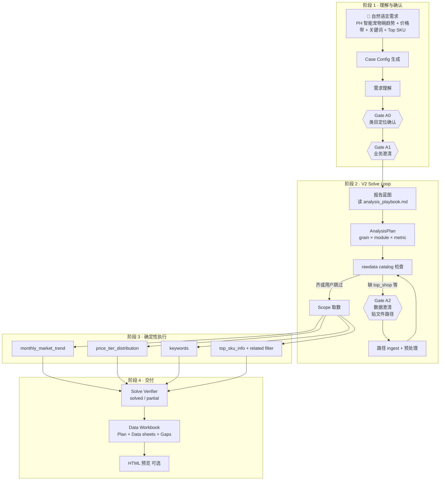
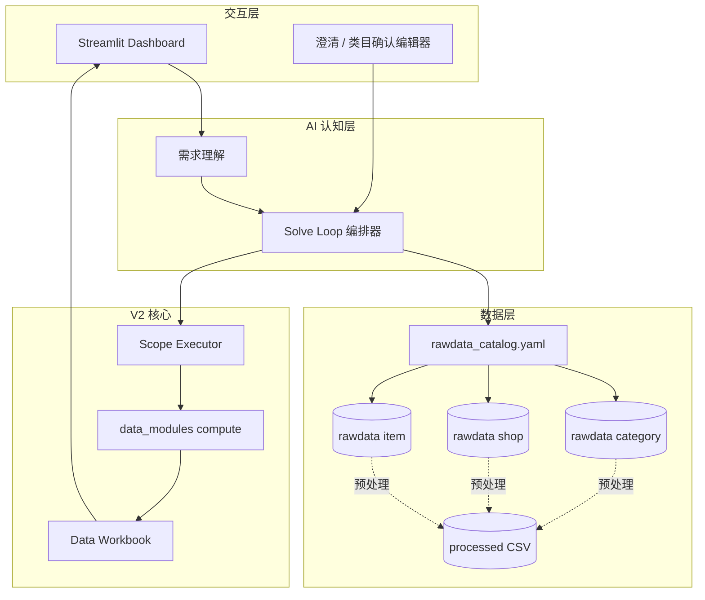

# CateMate

> 面向 **Category Analysis** 的 AI 辅助工作流 Demo — 把自然语言需求，转成可确认、可追溯、可审计的 **Data Workbook** 分析流水线。

[](LICENSE)
[](requirements.txt)
[](app/streamlit_dashboard.py)
[](docs/CATEMATE_V2_DESIGN_OVERVIEW.md)

**个人 AI Demo 项目，非生产系统。** 仓库不含真实业务源数据，请用 [`examples/`](examples/) 合成数据体验。

中文操作说明 → [README_使用说明.md](README_使用说明.md)

---

## V2 进度（当前迭代）

V2 核心公式：**分析语义 = Scope（取数）× Data Module（写死 Python 算数）**

Streamlit 默认模式为 **`v2_solve_loop`**，主交付物为 **`data_workbook_*.xlsx`**（Plan + 数据表族 + Gaps）；V1 的 PPT-ready 降为可选消费层。

| 阶段 | 内容 | 状态 |
|------|------|------|
| **0** | 可执行 data modules（`compute.py` + pytest） | ✅ 7 个模块已落地 |
| **1** | `rawdata_catalog.yaml` + 三维度源表登记 | ✅ 已落地 |
| **2** | Scope 取数层（`catemate/scope/`） | ✅ 已落地 |
| **3** | 意图编排 Solve Loop + 数据澄清 ingest | ✅ 已落地 |
| **4** | Data Workbook 组装（Plan / Data / Gaps） | ✅ 已落地 |
| **5** | 用 V2 模块逐步替换 V1 YAML 模块 | 🔄 进行中 |
| **6** | PPT-ready / HTML 从 Data Workbook 消费 | 🔄 部分可用 |

**已实现的 V2 数据模块**（`data_modules/`）：

| module_id | 用途 |
|-----------|------|
| `monthly_market_trend` | 月度 GMV / Orders / AOV 趋势（试点 pattern） |
| `daily_cncb_performance` | 日度 Shopee / CNCB 表现 |
| `price_tier_distribution` | 价格段分布 |
| `top_shop` | 头部店铺 |
| `top_listing` | 头部 listing |
| `top_sku_info` | Sub-L3 / 相关概念包下的 Top SKU |
| `keywords` | 关键词搜索 |

完整 V2 设计 → [docs/CATEMATE_V2_DESIGN_OVERVIEW.md](docs/CATEMATE_V2_DESIGN_OVERVIEW.md)

---

## 项目结构

```text
CateMate/
├── app/                          # Streamlit 交互层
│   ├── streamlit_dashboard.py    # 总控台（默认 v2_solve_loop）
│   ├── category_confirmation_editor.py
│   ├── clarification_editor.py   # 业务澄清 + rawdata 路径澄清
│   └── confirmation_editor.py    # V1 确认 Workbook 编辑
│
├── catemate/                     # Agent 内核
│   ├── understanding/            # 需求理解、类目确认、concept pack
│   ├── case_generation/          # 自然语言 → Case Config
│   ├── orchestration/            # V2 意图编排 + Solve Loop
│   ├── scope/                    # V2 取数层（filter → ScopedFrame）
│   ├── execution/                # V2 执行层（Scope × module → 表族）
│   ├── modules/                  # Workbook 组装（含 data_workbook.py）
│   ├── pipeline/                 # runner.py + v2_runner.py + manifest
│   ├── module_selection/         # V1 模块选择
│   ├── planning/                 # V1 确定性规划
│   ├── ppt_ready/                # HTML / PPT-ready 消费层
│   └── data/                     # rawdata catalog / ingest / loader
│
├── config/
│   ├── rawdata_catalog.yaml      # V2 源表登记（category/shop/item）
│   ├── analysis_playbook.md      # V2 报告蓝图章节 playbook
│   ├── data_modules/             # V1 扁平模块 YAML
│   ├── processed_data_sources.yaml
│   └── cases/                    # 本地 case（yaml 不进 Git）
│
├── data_modules/                 # V2 可执行模块（source_schema + compute.py）
├── scripts/                      # CLI 入口
├── tests/                        # 单测（data_modules / orchestration / scope）
├── examples/                     # 公开 demo 数据
├── docs/                         # 设计文档
│
├── CateMate_rawdata/        🔒   # 原始 Excel（三维度）
├── CateMate_processeddata/  🔒   # 预处理 CSV
├── outputs/runs/            🔒   # 流水线产物
└── _local/                  🔒   # 本机私有笔记
```

详细目录说明 → [docs/PROJECT_LAYOUT.md](docs/PROJECT_LAYOUT.md)

---

## 示例：一条需求如何被解决

以下用一条**虚构需求**演示 V2 主链路（`v2_solve_loop`）的完整求解过程。

### 需求输入

```text
分析菲律宾（PH）Pets > Pet Accessories > Bowls & Feeders 类目下
「智能宠物碗」相关商品：
1）最近几个月 GMV 与订单趋势；
2）价格带分布；
3）热门搜索词；
4）头部 SKU 列表（用于对标选品）。
```

### 求解流程



### 各阶段产物

| 步骤 | 阶段 | 产物 | 说明 |
|------|------|------|------|
| 1 | Case Config | `generated_case_config_*.yaml` | 结构化 case 草稿 |
| 2 | 需求理解 | `requirement_understanding_*.json` | 站点、类目、分析意图 |
| 3 | **Gate A0** | 更新 understanding | 确认 L1/L2/L3 类目映射 |
| 4 | **Gate A1** | 澄清答案合并 | 确认时间范围、分析优先级等 |
| 5 | 报告蓝图 | `report_blueprint_*.json` | 按 playbook 拆成 3–8 个可验证章节 |
| 6 | 分析计划 | `analysis_plan_*.json` | 每章绑定 module_id + metric + grain |
| 7 | **Gate A2** | rawdata 澄清（可选） | 缺 `dashboard_top_shop` 等时请用户贴路径 |
| 8 | Scope + Compute | 各 module 主表 / 延伸表 | `ScopedFrame` → `data_modules/*/compute.py` |
| 9 | 验证 | `solve_verdict_*.json` | `solved` 或 `partial`（有 Gaps 说明） |
| 10 | 交付 | `data_workbook_*.xlsx` | Plan / Data.\<table_id\> / Gaps |

### 本示例对应的模块编排（示意）

| 子问题 | module_id | grain | 输出 |
|--------|-----------|-------|------|
| GMV / 订单月度趋势 | `monthly_market_trend` | category | 趋势主表 + 站点占比延伸表 |
| 价格带分布 | `price_tier_distribution` | category | 价格段 ADG/ADO 表 |
| 热门搜索词 | `keywords` | category | 关键词排名表 |
| 智能宠物碗 Top SKU | `top_sku_info` | item | related concept 过滤后 Top N |

---

## V2 架构（主链路）



**与 V1 的关系：** V1 流程骨架（Streamlit、manifest、人工 gate）保留；V2 替换的是模块资产（YAML → Python）与编排方式（module selection → Solve Loop）。

V1 架构参考 → [docs/CATEMATE_V1_DESIGN_OVERVIEW.md](docs/CATEMATE_V1_DESIGN_OVERVIEW.md)

---

## 快速开始

### V2 主链路（推荐）

```powershell
pip install -r requirements.txt
copy .env.example .env          # 填写 DEEPSEEK_API_KEY

.\examples\bootstrap_demo_data.ps1
streamlit run app/streamlit_dashboard.py
# 选择默认模式 v2_solve_loop，输入自然语言需求
```

CLI 一键运行：

```powershell
python scripts/run_natural_language_requirement_pipeline.py `
  --request-text "分析 SG 文具类目月度 GMV 趋势" `
  --planning-mode v2_solve_loop
```

续跑（类目 / 澄清确认后）：

```powershell
python scripts/run_natural_language_requirement_pipeline.py --continue-from-manifest outputs/runs/<run>/pipeline_manifest_*.json
```

### V1 链路（兼容）

```powershell
python scripts/run_natural_language_requirement_pipeline.py --planning-mode module_selection
python scripts/run_category_requirement_case.py examples/cases/demo_stationery_sg.yaml
```

---

## 相关文档

| 文档 | 内容 |
|------|------|
| [**CATEMATE_V2_DESIGN_OVERVIEW.md**](docs/CATEMATE_V2_DESIGN_OVERVIEW.md) | V2 完整设计 |
| [CATEMATE_V1_DESIGN_OVERVIEW.md](docs/CATEMATE_V1_DESIGN_OVERVIEW.md) | V1 架构（兼容链路） |
| [PROJECT_LAYOUT.md](docs/PROJECT_LAYOUT.md) | 目录结构详解 |
| [data_modules/AUTHORING_SPEC.md](data_modules/AUTHORING_SPEC.md) | 模块写作规范 |
| [config/analysis_playbook.md](config/analysis_playbook.md) | 报告蓝图 playbook |
| [AI_CORE_INDEX.md](docs/AI_CORE_INDEX.md) | Agent 开发导航 |

---

## License

[MIT](LICENSE) — 个人 demo 项目，按原样提供，无生产级保证。
