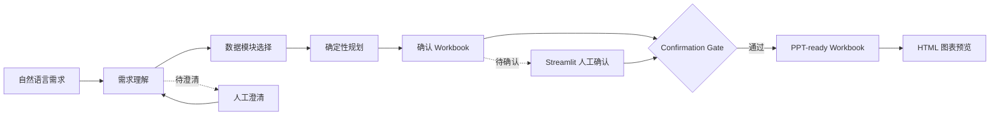
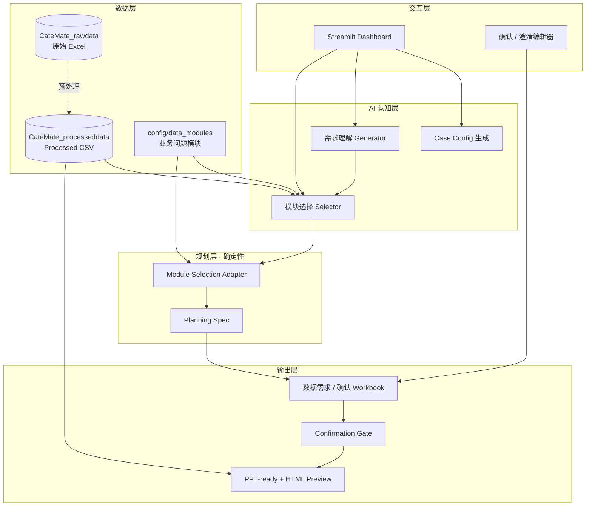
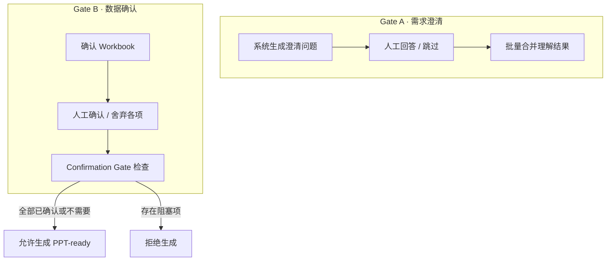

# CateMate

> 面向 **Category Analysis** 的 AI 辅助工作流 Demo — 把自然语言需求，转成可确认、可追溯、可生成 PPT-ready 数据的分析流水线。

[](LICENSE)
[](requirements.txt)
[](app/streamlit_app.py)

**个人 AI Demo 项目，非生产系统。** 仓库不含真实业务数据，请用 [`examples/`](examples/) 合成数据体验。

中文操作说明 → [README_使用说明.md](README_使用说明.md) · 完整设计文档 → [docs/CATEMATE_V1_DESIGN_OVERVIEW.md](docs/CATEMATE_V1_DESIGN_OVERVIEW.md)

---

## 架构设计

CateMate 的目标不是让 AI 直接「编一份报告」，而是把业务需求翻译成**可审查的数据准备流程**，在人工确认通过后再输出 PPT-ready 数据包。

### 三大设计原则

| 原则 | 说明 |
|------|------|
| **先理解，再生成** | 自然语言需求先结构化为站点、类目、分析意图、假设与待澄清问题 |
| **模块化，不自由发挥** | 从预定义 data module 目录中选择能力，而非让 AI 即兴设计图表 |
| **人工确认门禁** | 缺数、类目映射、关键假设未确认前，禁止生成 PPT-ready 输出 |

### 端到端流水线



### 分层架构



| 层级 | 职责 | 代码目录 |
|------|------|----------|
| **需求理解层** | 提取站点、类目、分析目标、假设与澄清问题 | `catemate/understanding/` |
| **模块选择层** | 从 data module 目录匹配业务问题（selected / optional / rejected） | `catemate/module_selection/` |
| **规划层** | 将选中模块转为 chart intent、指标、维度、排序规则 | `catemate/planning/` |
| **确认 Workbook** | 可审计的人工审查载体：类目映射、数据需求、图表规格 | `catemate/modules/` |
| **Confirmation Gate** | 阻断缺数 / 未确认映射 / 未完成确认项 | `catemate/core/confirmation_gate.py` |
| **PPT-ready 输出** | 结构化图表数据包 + 血缘说明 + HTML 预览 | `catemate/ppt_ready/` |

### 两道人工门禁



### 数据与模块：两层分工


- **数据资产层**（`CateMate_processeddata/`）：AI 优先读取的 processed CSV + manifest，避免反复打开大型 Excel
- **业务问题层**（`config/data_modules/*.yaml`）：每个模块描述「能回答什么业务问题、用哪些表、能生成什么图」

### 业务知识的三处迭代面

流程骨架（Streamlit、manifest、两道 gate、PPT-ready）相对稳定；**业务认知**主要在以下三处持续迭代：


| 迭代面 | 工作流步骤 | 配置载体 |
|--------|------------|----------|
| **A** 澄清策略 | 需求理解 | understanding prompt / schema |
| **B** 模块目录 | 模块选择 | `config/data_modules/*.yaml` |
| **C** 规划映射 | 确定性规划 | `module_selection_adapter` + 模块规则 |

---

## 快速开始

```powershell
pip install -r requirements.txt
copy .env.example .env          # AI 功能需填写 DEEPSEEK_API_KEY

.\examples\bootstrap_demo_data.ps1
python scripts/run_category_requirement_case.py examples/cases/demo_stationery_sg.yaml
streamlit run app/streamlit_app.py
```

一键完整链路（需 API Key）：

```powershell
python scripts/run_natural_language_requirement_pipeline.py --planning-mode module_selection
```

---

## 项目结构

```text
catemate/
  understanding/       需求理解层
  module_selection/    模块选择层
  planning/            规划层
  ppt_ready/           PPT-ready 生成
  core/                确认门禁、路径
app/                   Streamlit 总控台
config/
  data_modules/        业务问题模块（YAML）
  processed_data_sources.yaml
scripts/               CLI 入口
examples/              虚构 demo case + 合成数据
docs/                  设计文档
```

本地专用（不进公开仓库）：`CateMate_rawdata/` · `CateMate_processeddata/` · `outputs/`

---

## 相关文档

| 文档 | 内容 |
|------|------|
| [CATEMATE_V1_DESIGN_OVERVIEW.md](docs/CATEMATE_V1_DESIGN_OVERVIEW.md) | V1 完整架构与设计原则 |
| [data_module_catalog.md](docs/data_module_catalog.md) | 数据模块业务说明 |
| [AI_CORE_INDEX.md](docs/AI_CORE_INDEX.md) | Agent 开发导航索引 |
| [examples/README.md](examples/README.md) | 演示数据使用说明 |

---

## License

[MIT](LICENSE) — 个人 demo 项目，按原样提供，无生产级保证。
