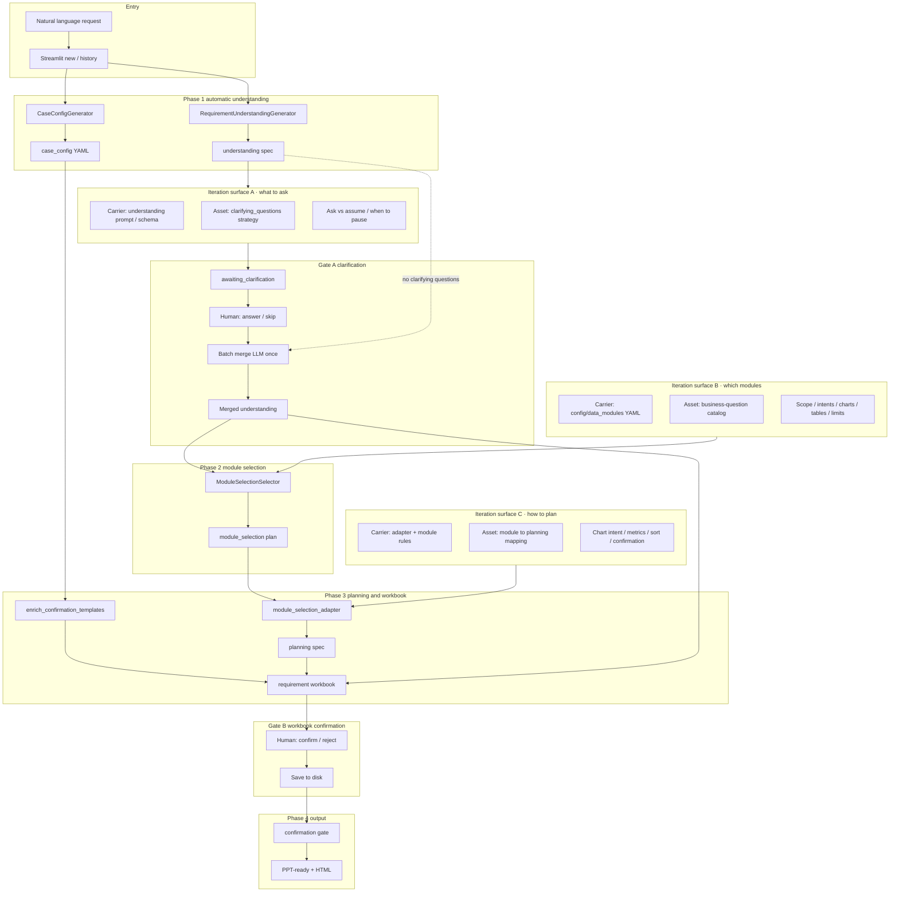
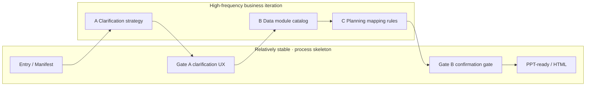

# CateMate V1 Design Overview

## What CateMate Is

CateMate is a workflow tool for category analysis. Its purpose is not to let AI directly invent a report, but to turn a business request into a traceable data preparation process that can later support PPT or report creation.

V1 focuses on one core problem:

> How can a category analysis request be translated into clear data requirements, confirmed by a human, and converted into PPT-ready data without fabricating numbers?

## Core Design Principle

CateMate V1 is built around three principles:

1. **Understand first, generate later**  
   A natural language request is first converted into structured understanding: target market, category, analysis intent, assumptions, and open questions.

2. **Use known data modules instead of free-form guessing**  
   The system selects from predefined data modules. Each module represents one business question, such as market trend, price tier distribution, top listing, top shop, or keywords.

3. **Human confirmation before data output**  
   Before generating PPT-ready data, CateMate creates a confirmation workbook. Missing data, category mapping, assumptions, and optional choices must be reviewed before the workflow can continue.

## V1 Workflow

```text
Natural language request
        |
        v
Requirement understanding
        |
        v
Data module selection
        |
        v
Deterministic planning spec
        |
        v
Data requirement / confirmation workbook
        |
        v
Human confirmation gate
        |
        v
PPT-ready workbook
        |
        v
HTML chart preview
```

## Layered Architecture

### 1. Requirement Understanding Layer

This layer reads the user's request and extracts the business meaning:

- target site or market
- target category or category candidates
- analysis goals
- expected output format
- assumptions
- clarification questions

The goal is to make the request reviewable before any data planning happens.

### 2. Data Module Selection Layer

CateMate does not ask the AI to freely invent analysis charts. Instead, it compares the request against predefined data modules.

Each module describes:

- what business question it answers
- which processed data tables it uses
- what default charts it can generate
- what limitations or assumptions apply

The module selection result classifies modules as:

- selected
- optional
- needs confirmation
- rejected

### 3. Planning Layer

After module selection, CateMate converts the selected modules into a structured planning spec. This step is deterministic in the recommended V1 path, so chart requirements come from module rules rather than ad hoc AI generation.

The planning spec defines:

- chart intent
- chart type
- source table
- metrics
- dimensions
- sorting rules
- optional flags

### 4. Confirmation Workbook

The confirmation workbook is the main human review artifact. It records:

- request summary
- category mapping candidates
- analysis plan
- data requirements
- source data checks
- preprocessing rules
- chart data requirements
- confirmation records

This workbook makes the analysis process auditable and editable.

### 5. Confirmation Gate

CateMate will not generate PPT-ready output unless the confirmation gate passes.

The gate protects against:

- unresolved missing data
- unconfirmed category mapping
- blocking assumptions
- incomplete confirmation records

This is the key safeguard against fabricated or prematurely generated data.

### 6. PPT-Ready Output

After confirmation, CateMate generates a PPT-ready workbook. This is a structured data package, not a finished presentation.

It includes:

- chart-ready sheets
- source lineage
- notes about missing or null values
- warnings where data is partial or limited

An HTML preview can also be generated to quickly inspect chart shapes and data sanity.

## Business Knowledge Iteration Surfaces

Most of the V1 pipeline is process scaffolding: entry, manifests, clarification UI, confirmation gate, and PPT-ready generation. That scaffolding should change infrequently.

The parts that must evolve with **business knowledge** are concentrated in three surfaces. These are the primary places to iterate as product judgment improves:

| Surface | Workflow step | Business question | Current home | Desired iteration shape |
|---------|---------------|-------------------|--------------|-------------------------|
| **A. Clarification strategy** | Requirement understanding | What must be asked vs assumed, and at what granularity | Understanding prompts / clarifying-question schema | Reviewable strategy or question bank, not only prompt prose |
| **B. Data module catalog** | Module selection | Which business analysis modules exist and when they apply | `config/data_modules/*.yaml` | First-class module assets: add/edit modules without rewriting selector code |
| **C. Planning mapping** | Deterministic planning | How a selected module becomes charts, metrics, and confirmation items | `module_selection_adapter` + rules inside each module | Push more rules into module config; keep the adapter thin and deterministic |

In short:

> **A** decides what to clarify → **B** decides which business questions the system can answer → **C** decides how selected questions become executable plans.  
> Gates, workbooks, and PPT-ready are process controls, not the main battlefield for business cognition.

### Full V1 architecture with iteration surfaces



### Stable process vs evolving cognition assets



| Layer | Role | Expected change rate |
|-------|------|----------------------|
| Process skeleton | Streamlit, manifest, two gates, PPT-ready | Low: reliability and UX |
| **A Clarification strategy** | What to ask | **High**: as business judgment evolves |
| **B Data module catalog** | What analysis capabilities exist | **High**: as data coverage and product scope grow |
| **C Planning mapping** | How modules become charts and confirmation items | **High**: as acceptance and metric definitions tighten |

### How this maps to current V1 code

- **A** is still mostly LLM + prompt constraints (few critical questions). Strategy is not yet a first-class configurable asset.
- **B** already has a YAML module catalog and is closest to a durable business asset.
- **C** on the recommended path is a deterministic adapter; quality is largely bounded by how well module rules in **B** are written, and how faithfully the adapter expands them.

Suggested iteration order when hardening these surfaces:

1. Treat **B** as the primary business module asset (catalog, review, versioning).
2. Push more of **C** into module configuration so the adapter stays thin.
3. Lift **A** from prompt prose into a reviewable clarification strategy or question bank.

### Note on Phase 1 dual generation

Phase 1 currently runs both `CaseConfigGenerator` and `RequirementUnderstandingGenerator` from the same request. They are not two copies of the same understanding step:

- **Understanding** drives clarification, module selection, and planning.
- **Case config** still supplies workbook templates and the older `ai_direct` path.

This dual path is a transitional layering. The cleaner direction is for understanding (after clarification merge) to become the single demand-cognition source, with case config derived or updated from it rather than generated in parallel at entry.

## What V1 Is Good At

CateMate V1 is useful for:

- turning vague category analysis requests into structured tasks
- checking which data modules are relevant
- making data needs explicit before analysis work begins
- preserving traceability from output back to source data
- preventing AI from fabricating unsupported numbers
- supporting internal PM or analyst review

## What V1 Is Not Yet

CateMate V1 is not yet:

- a polished multi-user product
- a final PPT generation engine
- a fully automated business judgment system
- a replacement for PM or analyst review

The current goal is to make the category analysis workflow reliable before making the final presentation layer more automated.

## Summary

CateMate V1 is designed as a controlled AI-assisted workflow for category analysis. Its most important idea is that AI should help structure the work, select relevant data modules, and prepare traceable data outputs, while human confirmation remains the gate before final data generation.

When improving V1 with business knowledge, prioritize the three iteration surfaces: **clarification strategy (A)**, **data module catalog (B)**, and **planning mapping rules (C)**. Keep process scaffolding stable unless the change is about reliability or UX.

