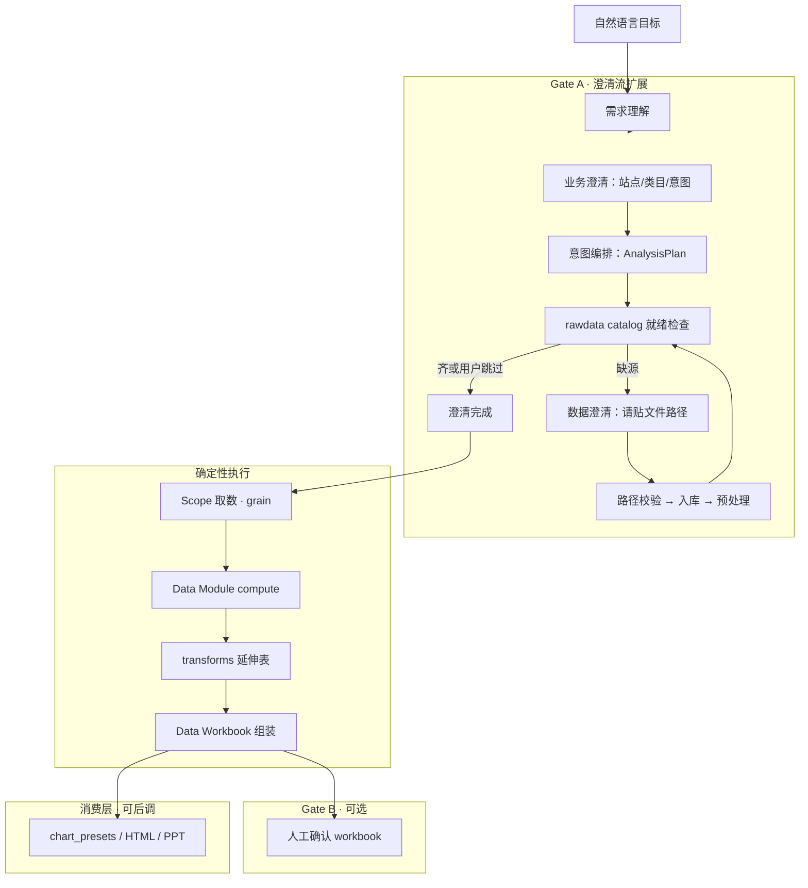
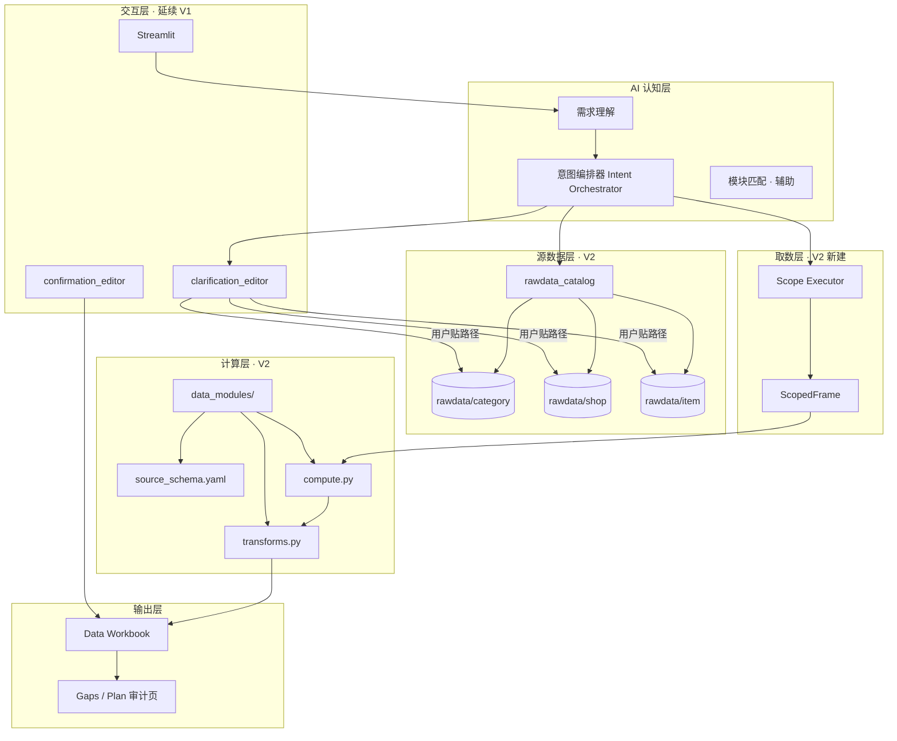

# CateMate V2 设计构想（迭代中）

> **状态：迭代中（Living doc）** — 描述 V2 目标架构与已拍板方向；**主链路仍以 V1 可运行为准**，V2 资产逐步在 `data_modules/` 等处落地。  
> 更新时间：2026-07-15  
> V1 对照：[CATEMATE_V1_DESIGN_OVERVIEW.md](CATEMATE_V1_DESIGN_OVERVIEW.md)

---

## V2 要解决什么

V1 已验证：**理解 → 选模块 → 确认 → PPT-ready** 的流程骨架可用，但业务算数仍大量依赖通用 `groupby` 猜测，模块是「YAML 说明书」而非确定性数据产品。

V2 聚焦一个更硬的目标：

> 如何把分析目标翻译成 **可编排、可缺数协商、可审计的 Data Workbook**——其中每一个数字都来自 **写死的 Python 模块**，而不是 Excel 公式或 LLM 即兴聚合？

PPT / HTML 预览在 V2 中降为**消费层**（可后调）；**Data Workbook** 是主交付物。

---

## V2 核心公式

```text
实际分析语义 = 取数方式（Scope）× 计算内核（Data Module）
```

- **Scope（外部取数）**：决定哪些行进入计算——站点、时间、类目/店铺/商品过滤、数据源选择。  
- **Data Module（计算内核）**：只规定**源列名 + Python 聚合规则**；不在模块内写死「研究哪个品类」、不规定 Excel 从哪来。

同一内核可被多次调用（不同 Scope、不同 `metric_id`），用于对照分析。

---

## V2 与 V1 的关系

| 维度 | V1（当前主链路） | V2（迭代方向） |
|------|------------------|----------------|
| 模块形态 | `config/data_modules/*.yaml` 扁平说明书 | `data_modules/<id>/` 目录化 + `compute.py` |
| 算数 | 通用 `chart_data_builder` groupby | 每模块写死 Python + 单测 |
| 源数据 | `CateMate_rawdata/` 扁平 Excel | `rawdata/{category,shop,item}/` 分维度 |
| 选能力 | 一次 module selection | **意图编排** loop：grain × module × metric |
| 缺数据 | workbook `missing_data_questions` | **澄清流扩展**：用户贴文件路径 → ingest |
| 主输出 | PPT-ready + HTML | **Data Workbook**（表族）；图表为软参考 |

**原则：V1 流程骨架保留**（Streamlit、manifest、Gate A/B）；V2 替换的是 **B 面模块资产** 与 **数据供给 / 编排** 方式。

---

## V2 端到端流水线（目标）



### 跳出数据澄清 loop 的条件

1. **用户不愿继续补充** — 对 `rawdata_*` 澄清题选择跳过；计划标记为 `partial`，Workbook 的 `Gaps` 区说明未覆盖项。  
2. **数据已齐或用户确认完成** — 结束 Gate A 数据阶段，进入 Scope + compute。

---

## 分层架构（V2）



| 层级 | 职责 | V2 载体 |
|------|------|---------|
| **意图编排** | 目标 → `AnalysisPlan`（grain、module、metric、scope）；缺源则生成澄清题 | 新建 `catemate/orchestration/`（规划） |
| **源数据 catalog** | 登记 category/shop/item 下表是否 available | `config/rawdata_catalog.yaml`（规划） |
| **Scope** | 读 processed 表、filter、输出带**源列名**的 DataFrame | 平台级，与单 module 解耦 |
| **Data Module** | 源列契约 + 写死算数 + 延伸表族 | `data_modules/<module_id>/` |
| **Data Workbook** | Plan + 各 `table_id` sheet + Gaps | 扩展现有 workbook 或新组装器 |

---

## 源数据：三维度目录

```text
CateMate_rawdata/
  category/     # 类目维度表（当前主要已有）
  shop/         # 店铺维度表（待用户补充）
  item/         # 商品维度表（待用户补充）
```

每张表在 **rawdata catalog** 中登记：

- `grain`：`category` | `shop` | `item`
- `table_id`、期望列、文件路径、`status`（`available` / `missing`）

用户通过 **澄清流** 粘贴本地文件路径 → 校验 → 复制/登记到对应子目录 → 预处理 → 更新 catalog。

> **已拍板**：数据补充后由用户**贴回文件完整路径**；系统在澄清合并阶段触发 ingest，不依赖自动爬取。

---

## Data Module（V2 资产模型）

目录：`data_modules/<module_id>/`（写作规范见 [data_modules/AUTHORING_SPEC.md](../data_modules/AUTHORING_SPEC.md)）

```text
source_schema.yaml    # 源列名 + compute_rules + transform_rules
contract.yaml         # 业务说明、outputs 登记、chart_presets（软）
compute.py            # 写死算数
transforms.py         # 延伸表（登记即全量计算）
<module_id>_review.md # 人读批注稿
```

### 硬性 vs 软性

| 必须写死 | 可后期调整 |
|----------|------------|
| `compute.py` / `transforms.py` | `chart_presets`（`binding: soft`） |
| `source_schema` 列名与规则 | HTML / PPT 样式 |
| 输出表 schema | 消费层选哪张表展示 |

### 试点模块：`monthly_market_trend`

| 项 | 规格 |
|----|------|
| 每次调用 | **一个** `metric_id`：`gmv` \| `orders` \| `aov` |
| 主表 | 一指标一表，grain = `grass_region × grass_month` |
| 延伸表 | 每指标 3 张：最新月各站 / 最新月占比 / 逐月环比 |
| grain 共用 | **category / shop / item 共用同一内核**；差异仅在 Scope 过滤与 catalog 源表 |
| 取数 | **不在 module 内**；由外部 Scope 传入已过滤行 |

---

## 意图编排：AnalysisPlan（概念）

编排器输出机器可读计划，示例：

```yaml
goal: VN 宠物类目月度 GMV 趋势 + 头部 shop 对比
runs:
  - run_id: r1
    grain: category
    module_id: monthly_market_trend
    metric_id: gmv
    scope_label: "VN / Pet Healthcare"
    required_catalog: category/dashboard_history

  - run_id: r2
    grain: shop
    module_id: monthly_market_trend
    metric_id: gmv
    status: blocked_until_rawdata
    missing: shop/shop_monthly_sales
```

同一 `monthly_market_trend` + 不同 `grain` = 不同 Scope，**不是**不同 module。

---

## Gate A 澄清流扩展（已拍板）

在现有 `clarifying_questions` / `awaiting_clarification` 上扩展，**不另开 UI**：

| 阶段 | 问题类型 | 示例 |
|------|----------|------|
| 1a 业务 | `clarify_*` | 站点、类目、时间窗、分析目标 |
| 1b 数据 | `rawdata_*` | 缺 shop 表时请粘贴文件完整路径；可跳过 |

实现触点（规划）：

- `catemate/understanding/schemas.py` — `expected_answer_type` 可增加 `FILE_PATH`
- `app/clarification_editor.py` — 分区展示数据补充题
- 澄清答案 handler — 路径 → ingest → `preprocess` → 刷新 catalog

---

## Data Workbook（V2 主交付）

| Sheet / 区块 | 内容 |
|--------------|------|
| **Plan** | 目标、AnalysisPlan、已执行 / blocked 的 run |
| **Data.\<table_id\>** | 各次 module 产出的主表与延伸表 |
| **Gaps** | 缺源、用户跳过、partial 说明 |
| **Confirmation** | 可选，延续 V1 Gate B |

「能完整回答目标」= Plan 中每个子问题有对应 Data sheet，或在 Gaps 中有显式说明。

---

## 业务认知迭代面（V2 演进）


| 面 | V1 | V2 |
|----|----|----|
| **A** | 问站点/类目 | + rawdata 就绪 loop、路径 ingest |
| **B** | YAML 说明书 | `source_schema` + Python + pytest |
| **C** | adapter + generic builder | 编排器 + Scope + 模块表族 → Workbook |
| **D** | default_charts 绑 chart_type | 绑 `output_table_id`，可覆盖 |

---

## 实施路线（建议）

| 阶段 | 内容 | 状态 |
|------|------|------|
| **0** | 可执行 data modules + 单测 | ✅ 2 active + 5 draft |
| **1** | `rawdata_catalog` + 三维度源表登记 | ✅ 已落地 |
| **2** | Scope 执行器 + related / concept pack | ✅ 已落地 |
| **3** | Solve Loop + `rawdata_*` 澄清 + 路径 ingest | ✅ 已落地 |
| **4** | Data Workbook 组装（Plan / Data / Gaps） | ✅ 已落地 |
| **5** | 逐步用 V2 模块替换 V1 YAML 模块 | 🔄 进行中 |
| **6** | PPT-ready / HTML 从 Data Workbook 消费 | 🔄 部分可用 |

---

## 相关文档

| 文档 | 内容 |
|------|------|
| [CHANGELOG.md](../CHANGELOG.md) | 版本记录（当前 v1.1.0） |
| [CATEMATE_V1_DESIGN_OVERVIEW.md](CATEMATE_V1_DESIGN_OVERVIEW.md) | 当前可运行架构 |
| [data_modules/AUTHORING_SPEC.md](../data_modules/AUTHORING_SPEC.md) | 模块写作指示 |
| [data_modules/monthly_market_trend_review.md](../data_modules/monthly_market_trend_review.md) | 试点模块批注稿 |
| [PROJECT_LAYOUT.md](PROJECT_LAYOUT.md) | 目录结构 |
| [AI_CORE_INDEX.md](AI_CORE_INDEX.md) | Agent 导航 |

---

## 修订记录

| 日期 | 说明 |
|------|------|
| 2026-07-16 | **v1.1.0**：solve loop 收束为 2 active 模块；新增 Sub-L3 / if_related / output_grain_policy；5 个模块降为 draft |
| 2026-07-15 | 初稿：Scope×Module、三维度 rawdata、澄清 loop、共用 monthly_market_trend、Data Workbook |
