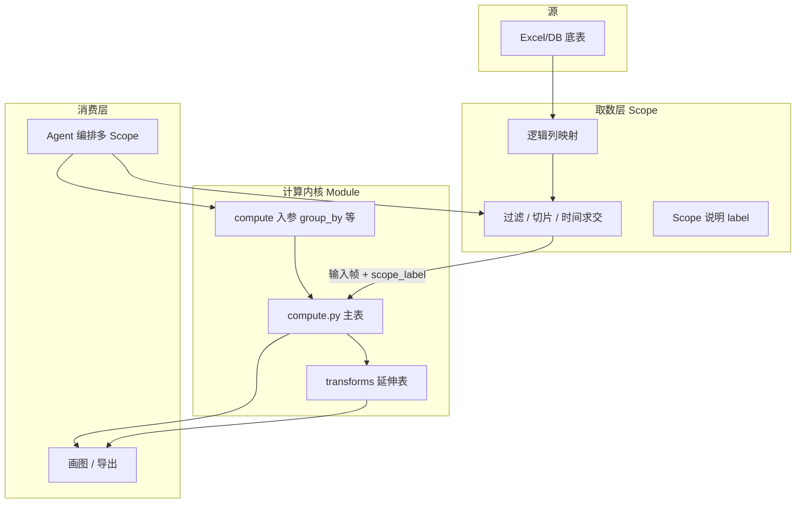

# CateMate 数据模块写作规范（草案）

更新时间：2026-07-14  
状态：**Living doc** — 与架构讨论同步迭代；试点模块落地前，以本文 + 批注为准。

## 0. 架构共识：取数 × 计算内核

**实际分析语义 = 取数方式（Scope）× 数据处理模块（Compute Kernel）**

- **取数（Scope / Fetch）**：决定「哪些行进入本次计算」——站点、时间窗、类目层级、item 子集、预筛选条件等。可由用户确认、由 Agent 组合、可多次执行以形成对比。
- **计算内核（Compute Kernel）**：模块内**只保留数据处理规则**——按哪些字段 `group_by`、对哪些指标 `sum/avg`、产出什么粒度的主表、延伸表怎么变换。**不在内核里写死「研究哪个品类」**。

同一内核，不同取数 → 不同业务含义，例如：

| 取数（Scope） | 同一计算内核 | 业务含义（示例） |
|---------------|--------------|------------------|
| 某 L3 类目下全部明细行 | `sum(gmv)` by `site × month` | 该类目分站点分月 GMV |
| 已预筛为「智能宠物碗」的 item 行 | `sum(gmv)` by `site`（或 by `item`） | 该细分品类的 GMV 结构 |
| 整个 L2 作为对照组 | 同上内核再跑一遍 | Agent 做「细分 vs L2 大盘」对比 |

**给 Agent 的自由度**：研究某一品类时，可先取「目标 L3 切片」与「上级 L2 切片」，**分别传入同一 `total_gmv` / `trend_by_month` 内核**，得到两张可对比的规范表——取数由 Agent 编排，算法规格不变。

```text
源底表（Excel 底表 / 将来 DB）
  → 【取数层】Scope：过滤 / 切片 / 字段映射（可多次、可并行）
  → 【计算内核】Module compute：聚合规则固定 → 主表
  → 【延伸层】Transforms：增速 / 占比 / 最新期等
  → 画图 / 确认 / 导出（自选主表或延伸表）
```

> **模块目录里的 `bindings.yaml`（试点期）** 仅描述「该内核假设输入帧里有哪些逻辑列」；**从底表到输入帧的过滤与切片** 归属取数层，不写入 `compute.py`。

---

## 1. 这份文档解决什么问题

CateMate V1 的 **B 面（Data Module Catalog）** 需要从「YAML 说明书 + 通用聚合猜测」升级为 **可版本化的确定性数据产品**：

```text
取数层（Scope）× 计算内核（Module）
  → 主数据表 + 延伸数据表（机器可读，非 Excel 算数）
  → 下游自选表 → 画图 / 导出 / 人工确认
```

本文规定：**写一个新模块时要写什么、怎么写、谁负责什么**。  
与现有 `docs/data_module_schema_v2.md` 的关系：

| 文档 | 角色 |
|------|------|
| `data_module_schema_v2.md` | V1 已落地的 **扁平 YAML** 字段说明（selection / planning 仍在读） |
| **本文** | 下一代 **目录化模块** 的写作规范（contract / bindings / compute / transforms） |
| `data_module_review_notes/*.md` | 产品/业务批注入口（自然语言 → 再同步到正式配置） |

过渡期允许「旧单文件 YAML + 新目录模块」并存；试点以目录形态为准，旧文件可作兼容壳。

---

## 2. 核心原则（写作时必须遵守）

1. **一个业务问题一个计算内核** — 内核描述「怎么算」，不描述「为谁算」；「为谁算」由取数层 Scope 决定。  
2. **取数与计算分离** — 模块内不写「只算 Pet Healthcare」这类业务切片；切片在取数层完成，再传入内核。  
3. **算数在 Python，不在 Excel、不让 LLM 算** — Agent 可**多次选 Scope、多次调同一内核**；LLM 不参与聚合算数。  
4. **输出是表族，不是单张图** — 每次「Scope × 内核」运行产出 **主表 + 可选延伸表**；图表是消费层。  
5. **主表 schema 硬契约** — 列名、类型、粒度、主键、空值规则必须机器可读；叙述性文案不能替代 schema。  
6. **延伸处理有限目录** — 只用平台登记的 transform 类型（见 §6），禁止每个模块私自发明「另一种增速算法」。  
7. **时间窗在取数层求交** — **用户意图 ∩ 底表可用时间** 在 Scope 阶段完成；内核假定输入帧已是目标时间范围。  
8. **保守缺失** — 默认不补空、不发明 YoY；底表没有的增长字段不得凭空生成。  
9. **源可替换** — 底表连接与列映射在**取数层**演进；内核只依赖**逻辑列名**与聚合规则。  
10. **算数写死、画图可改** — **只有产出数字的主表/延伸表**必须由确定性 Python 固定实现；画图、版式、用哪张表展示均可后期调整。模块内 `chart_presets` 仅为**预设参考**，不约束运行时必须遵守。

---

## 3. 模块目录结构（目标形态）

**计算内核（本规范主体）** — 每个模块一个目录：

```text
config/data_modules/<module_id>/
  contract.yaml      # 内核契约：聚合规则、计算入参、输出表 schema、默认图、planning 提示
  input_schema.yaml  # 可选：内核要求的输入帧逻辑列（非取数配置）
  compute.py         # 确定性：计算入参 + 已切片输入帧 → 主表
  transforms.py      # 可选：主表 → 延伸表
  README.md          # 可选：人类摘要
```

**取数层（平台级，逐步建设）** — 与单模块解耦，示例路径：

```text
config/data_scopes/ 或 catemate/scope/
  source_catalog.yaml    # 底表 / DB 表登记、逻辑列映射（原 per-module bindings 上收）
  scope_presets.yaml     # 可选：常用切片模板（如「单 L3」「整 L2」「item 子集」）
```

试点阶段可在模块旁保留 `bindings.yaml` **仅作「输入帧列映射说明」**，但**过滤/切片逻辑不得写进 `compute.py`**。

**批注文档**（产品侧）仍在：

```text
docs/data_module_review_notes/<module_id>_review.md
```

工作流：

```text
PM 在 review.md 批注
  → Agent/开发按本文规范更新 contract / bindings / compute
  → 单测 +（可选）scripts/validate_data_modules_v2.py 扩展校验
```

---

## 4. 分层职责（写作时对齐边界）



| 层 | 写什么 | 不写什么 |
|----|--------|----------|
| **取数 Scope** | 底表连接、列映射、类目/站点/时间/item 过滤、Scope 可读标签 | groupby 规则、延伸指标 |
| **contract** | 聚合规则、**计算入参**、输出 schema、默认图、planning 命中 | 写死「只算某个品类」 |
| **compute** | 对已切片输入帧做 groupby / 派生列 / 主表产出 | 类目业务判断、LLM、画图 |
| **transforms** | 登记过的延伸计算 | 未在 contract 登记的列 |
| **chart_presets** | 预设参考（默认用哪张表、倾向 trend/bar） | 算数、强制画图逻辑 |
| **画图 / HTML / PPT** | 消费表族、可改样式与图表类型 | 改 GMV/Orders 等数值 |

### 4.1 两类入参（写作时必须区分）

| 类型 | 归属 | 示例 | 谁决定 |
|------|------|------|--------|
| **Scope 参数** | 取数层 | 站点、时间窗、L1/L2/L3、item 关键词子集、预筛表 | 用户 / Agent / 确认项 |
| **Compute 参数** | 内核 contract | `group_by`、`metrics`、`output_time_grain` | 默认来自 contract；部分可由 Agent 在允许列表内选择 |

**同内核、不同 Scope 的典型 Agent 编排：**

```text
Run A: scope={ L3: Pet Healthcare, site: VN, time: ... }  → kernel=trend_by_month → 表 A
Run B: scope={ L2: Pets,           site: VN, time: ... }  → kernel=trend_by_month → 表 B
Compare: A vs B（占比、增速等走延伸层或下游）
```

---

## 5. contract.yaml 写什么

### 5.1 元信息与业务问题（延续 v2）

```yaml
schema_version: data_module_v3   # 草案标识，落地时与校验脚本对齐
module_id: dashboard_history_market_trend
module_name: 看板市场历史趋势
module_type: market_trend
status: active | deprecated
owner: CateMate
last_updated: "YYYY-MM-DD"

business_purpose:
  description: ...
  typical_questions: [...]
  decision_support: [...]
  not_suitable_for: [...]

planning_hints:
  explicit_triggers: [...]
  use_when: [...]
  avoid_when: [...]
  # 若与另一模块语义重叠，写 mutual_exclusive_with 或 preferred_over（待架构拍板）

limitations: [...]
```

**DECK Part、类目 meaning 等批注规则** 仍遵循 `docs/data_module_review_notes/README.md`。

### 5.2 入参 — Scope 与 Compute 分开写

**`scope_params`（不在模块内实现，但 contract 可文档化「典型取数方式」供 Agent 参考）**

写在 `contract.yaml` 的 `scope_expectations` 或平台取数规范中，**不**由 `compute.py` 执行：

```yaml
scope_expectations:
  description: 本内核常见如何取数；实际切片由取数层完成
  typical_sources: [dashboard_history]
  typical_filters: [site, time_window, category_L1/L2/L3, item_subset]
  notes:
    - 传入行已代表 Agent 选定的分析总体（如单一 L3 或某一 item 集合）
    - 同一内核可多次调用以做对照（目标品类 vs 上级 L2）
```

**`compute_params`（内核真正消费的参数）**

```yaml
compute_params:
  - param_id: group_by
    type: list[field_role]
    source: model | default
    required: true
    allowed:
      - [site, time_month]              # 如 trend
      - [site]                          # 如最新期 bar
    default: [site, time_month]
    description: 在输入帧上的聚合维度；不决定过滤哪些行

  - param_id: metrics
    type: list[metric_id]
    default: [gmv, orders]
    description: 对输入帧做 sum 的指标

  - param_id: derived_metrics
    type: list[metric_id]
    default: [aov]
    description: 主表内派生，如 gmv/orders
```

**取数层 category / 复合路径（Scope 侧说明）**

- 单段：`Pet Healthcare` → 在对应层级列上精确匹配  
- 复合路径：`Pets > Pet Healthcare` → 拆成 L1/L2（或 L1/L2/L3）**分别精确匹配（AND）**  
- 试点 **不做** 模糊映射、不做前台路径到 global 类目的自动纠错  
- **item 子集**：取数层可产出「已全是智能宠物碗」的输入帧，内核只负责 `sum(gmv)` by 约定维度  

### 5.3 主数据表（outputs.primary）

每张主表一份 schema 块：

```yaml
outputs:
  primary:
    - table_id: history_trend_by_site_month
      description: 过滤后按站点×月份的 GMV/Orders/AOV
      grain:
        - grass_region
        - grass_month
      primary_key:
        - grass_region
        - grass_month
      columns:
        - name: grass_region
          dtype: string
          role: site
          nullable: false
        - name: grass_month
          dtype: string
          role: time
          nullable: false
        - name: gmv_usd
          dtype: float
          role: metric
          nullable: true
          aggregation: sum
        - name: orders
          dtype: float
          role: metric
          nullable: true
          aggregation: sum
        - name: aov
          dtype: float
          role: derived_metric
          nullable: true
          rule: gmv_usd / orders; orders 为 0 或缺失时为空
      produced_by: compute.main
```

**写作要求：**

- `table_id` 全局唯一（模块内），稳定不随图表改名  
- `primary_key` 必须能唯一标识一行（审计、join、测试用）  
- `produced_by` 固定写 `compute.main` 或 `transform.<transform_id>`

### 5.4 延伸数据表（outputs.derived）

延伸表必须 **引用主表** + **引用 transform 类型**：

```yaml
  derived:
    - table_id: latest_month_by_site
      description: 主表时间范围内最新一个自然月的各站合计
      source_table_id: history_trend_by_site_month
      transform_id: latest_period_slice
      transform_params:
        period_field: grass_month
        agg_metrics: [gmv_usd, orders]
        recompute_derived: [aov]
      grain: [grass_region]
      primary_key: [grass_region]
      produced_by: transform.latest_period_slice

    - table_id: site_share_latest_month
      description: 最新月各站 GMV 占比
      source_table_id: latest_month_by_site
      transform_id: share_of_total
      transform_params:
        metric: gmv_usd
        group_by: []                       # 空表示对整张表求 total
      produced_by: transform.share_of_total
```

**写作要求：** 先写主表，再写延伸表；禁止延伸表依赖未登记的主表。

### 5.5 预设绘图参考（chart_presets，非强制）

`chart_presets` 是模块内保存的**绘图参考**，供规划 Agent、Streamlit 或 HTML 预览**默认选用**；  
**不是**算数契约的一部分，后期可改、可覆盖、可不用。

```yaml
chart_presets:
  - preset_id: market_history_default
    output_table_id: history_trend_by_site_month
    suggested_chart_type: auto_by_month_count   # >1 month → trend; 1 month → bar
    title_template: "{scope_label} 市场趋势"
    x: grass_month
    y: [gmv_usd, orders]
    series: grass_region
    notes: 仅供参考；消费层可换表、换图类型、改样式
    binding: soft                                   # 固定写 soft，表示非硬约束
```

**硬性契约**仅限 `outputs.primary` / `outputs.derived` 的 schema 与 `compute.py` / `transforms.py` 行为。  
**软性参考**包括：chart_type、颜色、标题模板、是否 trend/bar（含 §5.6 单月→bar 的**建议规则**，实现放在画图侧）。

### 5.6 主表粒度约定：默认 `site × month`（2026-07-14 共识）

**内核默认只产出一种主表粒度：`site × month`（站点 × 月份）。**

- 多个月 → 同一主表画 **折线 / 趋势图**  
- 仅一个月（Scope 或时间窗截断后只剩一个 `month`）→ 仍是 `site × month` 表，只是每个 site 一行 → 画图层自动用 **柱状图（bar）**，无需第二张主表、无需 Agent 改 `group_by`  
- 若业务需要「最新一个月」而输入窗有多月：用延伸 transform `latest_period_slice` 从主表切出，**仍保持 site 维度**；或画图时取 `max(month)` 子集，不新增主表粒度  

**写作要求：**

- 试点模块**不必**为 bar 单独维护 `latest_month_by_site` 主表，除非延伸表登记明确需要  
- **单月 → bar、多月 → trend** 写在 `chart_presets.suggested_chart_type` 或消费层，**不**写进 `compute.py`  
- **禁止**为「只有一个月」单独再做一个仅 `site` 粒度的主表内核（除非延伸层登记）

---

## 6. 平台标准 Transform 目录（延伸表只能从这里选）

写作延伸表时，`transform_id` 必须从下表选用；需要新类型时 **先改平台目录**，再在模块里引用。

| transform_id | 含义 | 典型参数 | 输出要求 |
|--------------|------|----------|----------|
| `latest_period_slice` | 取源表中 `period_field` 最大一期，按 `grain` 保留 | `period_field`, `agg_metrics`, `recompute_derived` | 新表 grain 不含时间维 |
| `share_of_total` | 某 metric 占合计比例 | `metric`, `group_by` | 增加 `share` 列或覆盖为比例列 |
| `period_growth` | 环比/同比（**仅当源表已有两期可比对**) | `metric`, `mode: mom\|yoy`, `period_field` | 不得发明缺失的历史期 |
| `rank_top_n` | 按 metric 排序截断 | `metric`, `n`, `order` | 用于 listing/shop 类模块 |
| `cumulative_in_window` | 时间窗内累计 | `metric`, `period_field` | 主表已裁剪后的累计 |

**禁止：** 在 `transforms.py` 里写模块私有的「第四种 share 算法」而不登记。

---

## 7. 取数层与 input_schema（原 bindings 上收）

### 7.1 平台取数目录（目标）

底表 → 逻辑列 → 切片，在**取数层**完成：

```yaml
# 示例：config/data_scopes/sources/dashboard_history.yaml
source_id: dashboard_history
training:
  kind: processed_csv
  table_id: dashboard_history
field_bindings:
  site: grass_region
  time_month: grass_month
  category_l1: cb_level1_global_be_category
  category_l2: level2_global_be_category
  category_l3: level3_global_be_category
  gmv: gmv_usd
  orders: orders
```

Scope 执行后交给内核：

```python
ScopedFrame(
  data: DataFrame,           # 已过滤、列已统一为逻辑名
  scope_label: str,         # 如 "VN / Pet Healthcare / L3 / 2026-01~06"
  scope_spec: dict,          # 可审计的过滤条件
)
```

### 7.2 模块内 input_schema.yaml（试点可替代 bindings.yaml）

只声明 **内核假设输入帧里有什么逻辑列**，不声明从哪张底表取：

```yaml
input_schema:
  required_columns: [site, time_month, gmv, orders]
  optional_columns: [category_l1, category_l2, category_l3, item_id, item_name]
  notes: 行级过滤已在 Scope 完成；内核不得再按类目写死过滤
```

**写作要求：**

- 换 DB / 换底表 → 改**取数层**映射，不改内核 `group_by` 规则（除非业务口径变更）  
- 内核 `compute.py` **不得** import 源表路径、不得读 manifest  

---

## 8. compute.py / transforms.py 写什么

### 8.1 compute.py

- 签名固定（试点约定）：

```python
def compute(
    params: ComputeParams,
    frame: ScopedFrame,
) -> dict[str, pd.DataFrame]:
    """对已切片输入帧做聚合；返回 {table_id: df}。"""
```

- 只做：按写死的 `group_by` 聚合 → 派生主表列（如 aov）→ 产出登记主表  
- **不做**：底表读取、Scope 过滤、**任何画图**、LLM  
- 每次调用应带上 `scope_label`，写入输出表元数据（供对比 Run A / Run B）  

**唯一必须「完全写死」的**：`compute.py` + `transforms.py`（数字逻辑）。其他皆可迭代。

### 8.2 transforms.py

- 输入：主表 dict + `contract.outputs.derived`  
- 输出：延伸表 dict  
- 每个 `transform_id` 对应平台实现或薄包装  

### 8.3 测试（写作交付物）

每个模块至少：

```text
tests/data_modules/<module_id>/test_compute.py
fixtures/<module_id>_sample.csv
expected/<table_id>.json 或 .csv
```

无验收 case 时，用 **人工构造的最小 fixture** 保证主键、列、空值规则稳定。

---

## 9. 与 V1 链路的关系（写作时心里有数）

| V1 现状 | 新模块如何接入（渐进） |
|---------|------------------------|
| `ModuleSelectionSelector` 读扁平 YAML | 短期仍可从 `contract` 抽出 `business_purpose` / `planning_hints` 给 selector |
| `module_selection_adapter` → planning charts | 中期改为引用 `chart_presets` + `output_table_id` |
| `chart_data_builder` 通用 groupby | 试点模块 **旁路** compute 表族；未迁移模块仍走 generic |
| `docs/data_module_review_notes` | 继续用；批注目标扩展为 contract/bindings/compute |

**写作时不必一次接完全链路**；先把 **contract + bindings + compute + 主表单测** 写对。

---

## 10. 模块写作检查清单

### 产品 / 业务（review.md）

- [ ] 模块回答什么业务问题？不回答什么？  
- [ ] 典型问法 / DECK Part 命中（若有）  
- [ ] 必填入参：类目？站点？时间？  
- [ ] 主表业务粒度一句话（如「每站每月」）  
- [ ] 需要哪些延伸视角（最新月、占比、增速）  
- [ ] 默认给分析师看哪两张图  
- [ ] 与易混淆模块的边界（如 RM vs 看板历史）  

### 工程（目录内文件）

- [ ] `contract.yaml`：`inputs` / `outputs.primary` / `outputs.derived` / `chart_presets` 完整  
- [ ] `bindings.yaml`：逻辑字段与 manifest 列一致  
- [ ] `compute.py`：仅产出已登记主表  
- [ ] `transforms.py`：仅使用 §6 登记 transform  
- [ ] 单测覆盖：过滤、时间求交、空 orders→aov 为空  
- [ ] `limitations` 与 `do_not_invent_yoy` 等与代码行为一致  

---

## 11. 试点模块：dashboard_history_market_trend（当前共识）

以下作为第一个按本规范落地的模块草案（**随讨论更新**）：

| 项 | 共识 |
|----|------|
| 时间窗 | 不强制 12 个月；用户区间 ∩ 底表月份；未指定则用过滤后全部月份 |
| 站点 | 未指定 → 全站 |
| **主表粒度** | **固定 `site × month` 一张主表**；不单为 bar 再建 `site-only` 主表 |
| **画图** | 主表 `distinct(month) > 1` → 建议 trend；仅 1 个月 → 建议 bar（**画图侧实现，非算数**） |
| 延伸 | 可选 `latest_period_slice`（从主表取最新月，仍源于 site×month）；占比等走 transform |
| 取数 × 内核 | Scope 在外；内核只 `group_by [site, month]` 写死 |
| 与 RM 模块 | 倾向长期只保留一个「月度市场趋势」能力；具体合并/互斥 **待架构拍板** |
| 验收 case | 暂无；用 fixture 单测先行 |

---

## 12. 待讨论项（下一轮架构迭代）

写作规范依赖以下决策，**未定前不要在代码里写死**：

1. **取数层产物形态**：`ScopedFrame` 是否落盘（Parquet）、是否进 manifest 审计？  
2. **`group_by` 由谁选**：Agent 在 `allowed` 列表内自选 vs 每个内核固定一种粒度？  
3. **无 Scope 标签的输入**：是否拒绝运行（强制每次带 `scope_label`）？  
4. **RM vs dashboard_history**：合并为双源 Scope + 同一 trend 内核，还是两个内核？  
5. **schema_version 命名**：`data_module_v3` 与旧 `v2` 校验脚本如何共存？  
6. **延伸表**：全量预计算 vs 按需懒算？  
7. **逐个替换旧模块**：迁移顺序、双跑对比窗口多长？  

---

## 13. 相关文档

- 架构总览：`docs/CATEMATE_V1_DESIGN_OVERVIEW.md`（B/C 迭代面）  
- 旧版 YAML 字段：`docs/data_module_schema_v2.md`  
- 批注工作流：`docs/data_module_review_notes/README.md`  
- 模块目录（人类可读）：`docs/data_module_catalog.md`  
- AI 导航：`docs/AI_CORE_INDEX.md`  

---

## 修订记录

| 日期 | 说明 |
|------|------|
| 2026-07-14 | 初稿：表族模型、contract/bindings/compute/transforms、试点 history 共识 |
| 2026-07-14 | 增补 §0/§4：取数 × 计算内核分离；Scope 与 Compute 入参拆分；bindings 上收取数层 |
| 2026-07-14 | §5.6/§11：主表固定 site×month；单月自动 bar、多月 trend |
| 2026-07-14 | 算数写死 vs chart_presets 软性参考（§2/§5.5/§8） |
